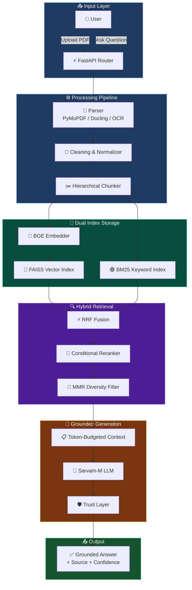
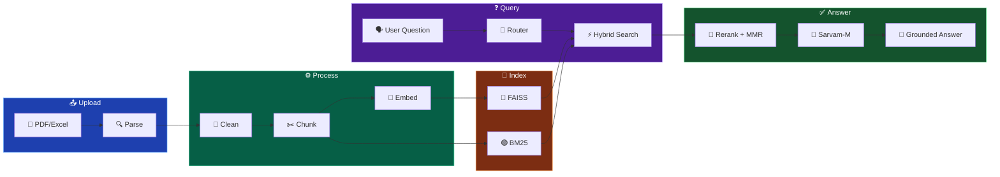

<div align="center">

<!-- Animated Header -->


<!-- Badges -->
[](https://python.org)
[](https://fastapi.tiangolo.com)
[](LICENSE)
[](https://github.com/facebookresearch/faiss)
[](https://sarvam.ai)

<br/>

<!-- Stats -->


<br/>

> **A production-grade Retrieval-Augmented Generation (RAG) pipeline** combining hybrid information retrieval, multi-stage reranking, grounded LLM generation, and evaluation-driven optimization — delivering a personalized AI learning and student monitoring platform.

<br/>


</div>

## ⚡ Quick Overview

```
📄 Upload a Document  →  🧠 AI Processes & Indexes  →  🎯 Ask, Search, Quiz, Learn
```

<table>
<tr>
<td width="50%">

### 🎓 For Students
- 🤖 Ask AI — Get grounded answers from your documents
- 🔍 Google-like Search — Keyword, Hybrid, or AI mode
- 📝 Auto-generated Quizzes & Mock Tests
- 📊 Weakness Detection & Personalized Recommendations
- 🃏 Flashcards for quick revision
- 🏆 Gamification — XP, Levels, Leaderboard

</td>
<td width="50%">

### 👨‍🏫 For Educators
- 📚 Subject-based Content Library
- 🔄 LLM Auto-Classification of documents
- 📈 Student performance monitoring
- 🎯 50+ question evaluation engine
- 📋 Structured summary generation
- 🏅 Real-time class leaderboard

</td>
</tr>
</table>

<br/>

<div align="center">

</div>

## 🏗️ Architecture

<div align="center">



</div>

<br/>

## 🚀 Core Features

<table>
<tr>
<td align="center" width="33%">

### 🤖 RAG Pipeline


---
End-to-end grounded Q&A with strict prompt constraints. Chain-of-thought cleanup. Zero hallucination by design.

</td>
<td align="center" width="33%">

### 🔍 Hybrid Search


---
Parallel vector + keyword search with RRF fusion. Dynamic weight routing per query type. Google-like UI.

</td>
<td align="center" width="33%">

### 🎯 Smart Reranker


---
Cross-encoder reranking only when needed. Saves 150-300ms on confident queries while boosting precision.

</td>
</tr>
<tr>
<td align="center" width="33%">

### 📝 Quiz Engine


---
LLM-generated quizzes from document content. Flashcards, mock tests, instant grading.

</td>
<td align="center" width="33%">

### 📊 Weakness Detection


---
Tracks per-topic quiz accuracy. Identifies weak areas. Generates targeted study recommendations.

</td>
<td align="center" width="33%">

### 📚 Content Library


---
LLM auto-classifies uploaded documents into subject folders. Tag, view, delete, organize.

</td>
</tr>
<tr>
<td align="center" width="33%">

### 🏆 Gamification


---
Earn XP for quizzes and activities. Level up. Real-time leaderboard with cached performance.

</td>
<td align="center" width="33%">

### 🛡️ Trust Layer


---
Every answer includes confidence score + source page/section. Low confidence → "Not in document."

</td>
<td align="center" width="33%">

### 📈 Evaluation Engine


---
Built-in evaluation: Recall@k, MRR, accuracy, hallucination rate. Ablation study ready.

</td>
</tr>
</table>

<br/>

<div align="center">

</div>

## 🔬 Tech Stack

<div align="center">

| Layer | Technology | Badge |
|:---:|:---:|:---:|
| **Backend** | FastAPI + Uvicorn |  |
| **LLM** | Sarvam-M (HTTP API) |  |
| **Embeddings** | sentence-transformers (BGE) |  |
| **Vector DB** | FAISS (facebook) |  |
| **Keyword** | BM25 (custom) |  |
| **Database** | SQLite + SQLAlchemy 2.0 |  |
| **PDF** | PyMuPDF + Docling + OCR |  |
| **Frontend** | Vanilla JS + CSS (SPA) |  |
| **HTTP** | httpx (async) |  |

</div>

<br/>

## 🔄 How It Works

<div align="center">



</div>

<br/>

## 🔥 Retrieval — RRF Fusion Formula

```python
# Reciprocal Rank Fusion — merges vector + keyword rankings
rrf_score(chunk) = vector_weight × 1/(rrf_k + vector_rank)
                 + bm25_weight  × 1/(rrf_k + bm25_rank)
```

| Query Type | Vector Weight | BM25 Weight | Strategy |
|:---:|:---:|:---:|:---|
| 🎯 Factual | `0.3` | `0.7` | BM25-heavy — exact term match |
| 💡 Conceptual | `0.7` | `0.3` | Vector-heavy — semantic similarity |
| 🔗 Multi-hop | `0.5` | `0.5` | Balanced + multi-query expansion |

<br/>

## ⚡ Performance

| Metric | Value |
|:---|:---:|
| 🔍 BM25 Only | ~20ms |
| 🧠 Vector Only | ~30ms |
| ⚡ Hybrid RRF | ~60ms |
| 🎯 + Conditional Reranker | ~120–400ms |
| 🔀 + MMR Diversity | ~150–450ms |

<br/>

<div align="center">

</div>

## 📦 Project Structure

```
timepass/
├── 📂 backend/
│   ├── 📂 app/
│   │   ├── 🚀 main.py                 ← FastAPI app + lifespan
│   │   ├── ⚙️ config.py               ← All environment config
│   │   ├── 🧠 state.py                ← Shared in-memory state
│   │   ├── 🗄️ database.py             ← SQLAlchemy ORM
│   │   │
│   │   ├── 📂 api/routes.py           ← All REST endpoints
│   │   ├── 📂 parser/                 ← PyMuPDF / Docling / OCR
│   │   ├── 📂 chunking/              ← Hierarchical chunker
│   │   ├── 📂 rag/                    ← Embedder, FAISS, LLM client
│   │   ├── 📂 indexing/              ← Vector + BM25 indexes
│   │   ├── 📂 retrieval/             ← Hybrid RRF + MMR
│   │   ├── 📂 reranker/              ← Conditional BGE reranker
│   │   ├── 📂 query/                 ← Router + Expander
│   │   ├── 📂 llm/trust.py           ← Confidence + Citations
│   │   ├── 📂 evaluation/            ← 50+ test suite
│   │   ├── 📂 generators/            ← Prompt templates
│   │   ├── 📂 personalization/       ← Weakness detection
│   │   ├── 📂 gamification/          ← XP + Leaderboard
│   │   ├── 📂 search/                ← Search engine layer
│   │   ├── 📂 core/                  ← Classifier + Library
│   │   └── 📂 tasks/                 ← Background workers
│   │
│   ├── 📂 frontend/
│   │   ├── 🌐 index.html             ← SPA shell
│   │   ├── ⚡ app.js                  ← Full app logic (~61KB)
│   │   └── 🎨 styles.css             ← Premium UI (~40KB)
│   │
│   └── 📋 requirements.txt
│
└── 📂 storage/                        ← FAISS + BM25 indexes
```

<br/>

## 🚀 Quick Start

```bash
# 1. Clone
git clone https://github.com/Nishant-aiml/iveri-llm-advanced-rag-learning-system.git
cd iveri-llm-advanced-rag-learning-system

# 2. Setup
cd backend
python -m venv venv
venv\Scripts\activate          # Windows
# source venv/bin/activate     # Linux/Mac

# 3. Install
pip install -r requirements.txt

# 4. Configure (.env file)
echo SARVAM_API_KEY=your_key_here > .env
echo SARVAM_API_URL=https://api.sarvam.ai/v1/chat/completions >> .env

# 5. Run
uvicorn app.main:app --host 0.0.0.0 --port 8000
```

<div align="center">

| Interface | URL |
|:---:|:---:|
| 🌐 **Web App** | `http://localhost:8000` |
| 📖 **Swagger API** | `http://localhost:8000/docs` |
| 📄 **ReDoc** | `http://localhost:8000/redoc` |

</div>

<br/>

## 📊 Evaluation & Metrics

| Metric | Description |
|:---|:---|
| **Recall@k** | Fraction of relevant chunks in top-k results |
| **MRR** | Mean Reciprocal Rank of first relevant chunk |
| **Answer Accuracy** | LLM answer correctness vs ground truth |
| **Hallucination Rate** | % of answers with ungrounded content |
| **Latency (p50/p95)** | End-to-end response time |

### Ablation Study

| Configuration | Recall@5 | MRR | Accuracy |
|:---|:---:|:---:|:---:|
| Vector-only baseline | 🟡 Low | 🟡 Low | 🟡 Medium |
| + BM25 Hybrid (RRF) | 🟢 Higher | 🟢 Higher | 🟢 Better |
| + Conditional Reranker | 🔵 High | 🔵 High | 🔵 High |
| + Query Expansion | 🟣 **Best** | 🟣 **Best** | 🟣 **Best** |

<br/>

## 🛣️ Roadmap

- [ ] 🔄 Streaming LLM responses (real-time)
- [ ] 🧬 Graph-based retrieval for multi-hop queries
- [ ] 📊 Teacher analytics dashboard
- [ ] 🌐 Multi-LLM support (OpenAI, Gemini, Ollama)
- [ ] 🔍 Elasticsearch for scalable keyword search
- [ ] 📱 Mobile-responsive redesign
- [ ] 🧠 Fine-tuned domain embeddings

<br/>

<div align="center">

</div>

## 👨‍💻 Author

<div align="center">

| | |
|:---:|:---|
| 🧑‍💻 | **Nishant Datta** |
| 🏗️ | Lead Architect & Engineer |
| 🎯 | RAG Pipeline, Retrieval, Evaluation, Frontend |

<br/>

[](https://github.com/Nishant-aiml)

</div>

<br/>

<div align="center">

> *"This is not a student project. This is a system."*

<br/>


</div>
