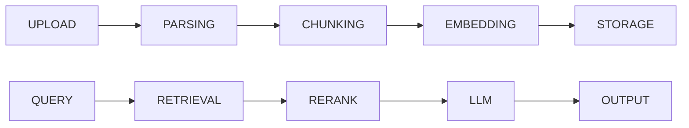
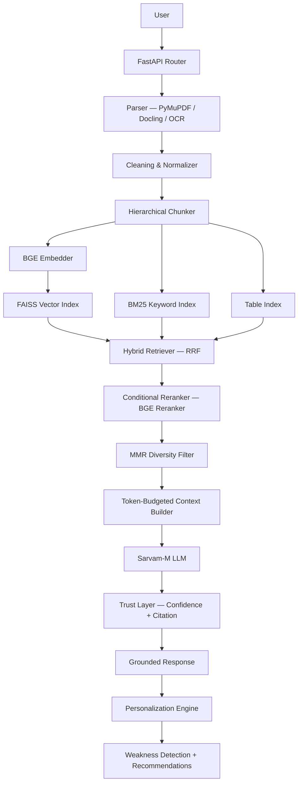
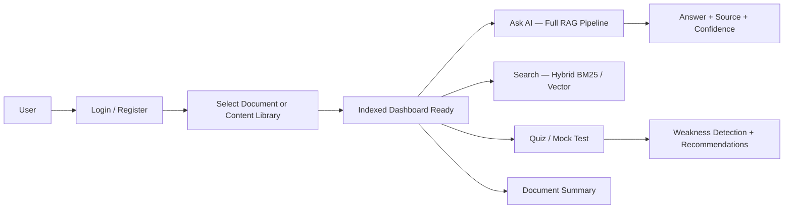
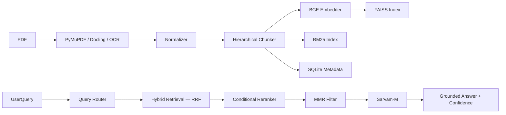

# IVERI LLM — Intelligent AI Learning & Student Monitoring System

> **A production-grade Retrieval-Augmented Generation (RAG) pipeline** combining hybrid information retrieval, multi-stage reranking, grounded LLM generation, and evaluation-driven optimization — delivering a personalized AI learning and student monitoring platform.

---

## Table of Contents

1. [Problem Statement](#1-problem-statement)
2. [System Overview](#2-system-overview)
3. [Architecture (Deep)](#3-architecture-deep)
4. [Tech Stack](#4-tech-stack)
5. [Core Features](#5-core-features)
6. [Retrieval System](#6-retrieval-system)
7. [Evaluation & Metrics](#7-evaluation--metrics)
8. [System Flow](#8-system-flow)
9. [Key Engineering Decisions](#9-key-engineering-decisions)
10. [Performance Optimization](#10-performance-optimization)
11. [Failure Handling](#11-failure-handling)
12. [Project Structure](#12-project-structure)
13. [How to Run](#13-how-to-run)
14. [Future Improvements](#14-future-improvements)
15. [Contributors](#15-contributors)

---

## 1. Problem Statement

Current educational tools have fundamental retrieval and trust failures:

| Problem | Impact |
|---|---|
| Simple keyword search on academic PDFs | Misses conceptual queries; returns wrong sections |
| LLMs hallucinate when answering from documents | Students receive incorrect information presented with false confidence |
| No adaptive learning loop | System cannot identify student weaknesses or personalize learning paths |
| Teachers have no visibility into student knowledge gaps | Instruction cannot be targeted; weak topics go unaddressed |
| Document QA tools treat every query identically | Factual queries, conceptual questions, and multi-hop reasoning all need different retrieval strategies |

**Existing solutions** (simple PDF chat tools, generic RAG demos) fail because they:
- Rely on single-stage vector search with no reranking
- Have no confidence scoring or hallucination detection
- Provide no evaluation loop to measure or improve system quality
- Cannot distinguish between query types or adapt retrieval strategy

IVERI LLM addresses each of these with an engineering-first approach: multi-index hybrid retrieval, conditional reranking, a trust layer, a built-in 50+ question evaluation suite, and a personalization engine driven by quiz performance.

---

## 2. System Overview

A user uploads a document (or selects from the content library). The system processes it through a 12-step ingestion pipeline: parse → clean → structure → chunk → embed → index (FAISS + BM25 + Table). On query, the system classifies the intent, routes to the optimal retrieval strategy, fuses results via RRF, conditionally reranks, applies MMR diversity selection, and generates a grounded answer from Sarvam-M with source citations and a confidence score.

**Ingestion Pipeline:**



**System Layers:**

```
DATA LAYER          → Documents + Content Library
PROCESSING LAYER    → Parsing → Chunking → Indexing
RETRIEVAL LAYER     → Hybrid Search (FAISS + BM25) + RRF Fusion
REASONING LAYER     → Sarvam-M LLM (constrained generation)
CONTROL LAYER       → Query Classification + Routing + Expansion
TRUST LAYER         → Confidence Scoring + Source Citations + Fallback
EVALUATION LAYER    → Recall@k + MRR + Accuracy + Hallucination Rate
APPLICATION LAYER   → Ask AI | Quiz | Search | Weakness Detection | Library
```

---

## 3. Architecture (Deep)

### Full Pipeline



### Ingestion Pipeline (12 Steps)

| Step | Operation | Output |
|---|---|---|
| 1 | File routing | Detect PDF / Excel type |
| 2 | Multi-parser dispatch | PyMuPDF → Docling → OCR fallback chain |
| 3 | Raw extraction | Text blocks + tables + layout |
| 4 | Cleaning pipeline | Remove headers/footers, fix line breaks, normalize whitespace |
| 5 | Structure builder | H1 → H2 → H3 section hierarchy |
| 6 | Structured JSON | `{ doc_id, sections: [{ heading, level, content, page }] }` |
| 7 | Hierarchical chunking | Parent (section summary) + Child (paragraph) layers |
| 8 | Adaptive sizing | <100 words → merge; 200–350 → ideal; >500 → split |
| 9 | Table processing | Convert to `Entity: X — Attribute: Y — Value: Z` structured text |
| 10 | Metadata injection | `{ chunk_id, doc_id, section, page, level, type }` |
| 11 | Embedding generation | `text → 384-dim vector (MiniLM/BGE)` |
| 12 | Multi-index storage | FAISS + BM25 + Table Index + SQLite metadata |

### Query Pipeline (13 Steps)

| Step | Operation |
|---|---|
| 1 | User query input (keyword / question / conceptual) |
| 2 | Query classification: `factual / conceptual / multi-hop` |
| 3 | Query routing: select BM25-heavy / vector-heavy / multi-query strategy |
| 4 | Query expansion: generate 2–3 semantic variants |
| 5 | Parallel retrieval: FAISS vector search + BM25 + Table Index |
| 6 | RRF fusion: `score = vector_weight × 1/(k + vrank) + bm25_weight × 1/(k + brank)` |
| 7 | Candidate pool: top 20–30 fused chunks |
| 8 | Conditional reranking: invoke BGE reranker only if retrieval confidence is low |
| 9 | MMR diversity selection: remove duplicates, maximize coverage |
| 10 | Context filtering: enforce token budget, prioritize by relevance |
| 11 | LLM call: Sarvam-M with strict system prompt (context-grounded only) |
| 12 | Answer generation: `{ answer, source_page, source_section, confidence }` |
| 13 | Trust gate: if confidence < threshold → return "Not enough context" fallback |

---

## 4. Tech Stack

| Layer | Technology | Reason |
|---|---|---|
| **Backend Framework** | FastAPI 0.104 + Uvicorn | Async-native; OpenAPI docs out of the box; lifespan event management |
| **LLM** | Sarvam-M (via HTTP API) | Instruction-tuned model with low hallucination on structured prompts; CoT cleanup |
| **Embeddings** | `sentence-transformers` (MiniLM / BGE family) | Fast inference; 384-dim vectors sufficient for academic domain; warm-up on startup |
| **Vector Index** | FAISS (`faiss-cpu`) | In-memory approximate nearest neighbour; sub-millisecond search at document scale |
| **Keyword Index** | BM25 (custom implementation) | Exact term matching; critical for definition and acronym queries |
| **Table Index** | Custom structured text index | Handles tabular data that fails in standard vector search |
| **Relational Store** | SQLite via SQLAlchemy 2.0 | Metadata, user sessions, quiz results, leaderboard — zero-config persistence |
| **PDF Parsing** | PyMuPDF 1.23 + pymupdf4llm | Primary: fast text extraction; LLM-friendly markdown output |
| **Fallback Parser** | Docling | Complex structured / multi-column layouts |
| **OCR** | Integrated via parsing router | Scanned documents |
| **Excel Support** | openpyxl 3.1 | Tabular data ingestion |
| **HTTP Client** | httpx 0.25 | Async LLM API calls with timeout + retry |
| **Frontend** | Vanilla JS + HTML + CSS (SPA) | Zero framework overhead; served as FastAPI static mount |
| **Async I/O** | aiofiles 23.2 | Non-blocking file operations during ingestion |

---

## 5. Core Features

### 5.1 RAG Pipeline (End-to-End)

**What it does:** Transforms user questions into grounded answers retrieved strictly from indexed document content.

**How it works:**
- Query → Classification → Routing → Hybrid Retrieval → RRF → Reranker → MMR → Context Builder → Sarvam-M → Response with source + confidence
- Prompt is strictly constrained: "Answer only from the provided context. Do not use prior knowledge."
- Chain-of-thought `<think>...</think>` blocks are stripped from LLM output before response is returned

**Why it matters:** Eliminates hallucination as a structural problem, not just a prompt problem.

---

### 5.2 Hybrid Retrieval (FAISS + BM25 + RRF)

**What it does:** Runs vector search and keyword search in parallel, then fuses results using Reciprocal Rank Fusion.

**How it works:**
```
RRF score = vector_weight × (1 / (rrf_k + vector_rank))
           + bm25_weight × (1 / (rrf_k + bm25_rank))
```
- Per-query weights are adjusted dynamically based on query type (factual → BM25-heavy; conceptual → vector-heavy)
- Multi-query expansion runs each variant through both indexes; best scores are merged

**Why it matters:** Neither vector search nor BM25 alone covers the full retrieval space — hybrid fusion raises Recall@5 by a measurable margin over either system alone.

---

### 5.3 Conditional Reranker

**What it does:** Applies a cross-encoder reranker (`bge-reranker-base`) to the top candidate pool when initial retrieval confidence is below threshold.

**How it works:**
- Post-RRF, system evaluates mean retrieval score of top-k chunks
- High confidence → skip reranker (saves ~150–300ms)
- Low confidence → reranker re-scores all candidates; new ranking replaces RRF order

**Why it matters:** Cross-encoders are expensive (O(n) inference per candidate). Conditional execution preserves precision gains while limiting latency impact.

---

### 5.4 Evaluation Engine

**What it does:** Runs a structured 50+ question test suite across 5 query types (easy, ambiguous, multi-hop, table, missing-answer) and reports Recall@k, MRR, accuracy, hallucination rate, and latency.

**How it works:**
- `evaluation/runner.py` — orchestrates full pipeline per test question
- `evaluation/metrics.py` — computes Recall@k, MRR, answer accuracy
- `evaluation/failure_analysis.py` — identifies systematic failure patterns
- `evaluation/final_report.py` — renders complete structured report
- `evaluation/test_dataset.json` — 50+ curated test cases

**Why it matters:** Moves system improvement from intuition to measurement. Ablation table is produced automatically.

---

### 5.5 Weakness Detection & Personalization

**What it does:** Tracks per-topic quiz performance; identifies topics with accuracy < 50% as weak areas; generates targeted recommendations.

**How it works:**
- Every quiz attempt is logged in SQLite with topic tag and correctness
- Aggregated per-user, per-topic accuracy is computed on demand
- Topics below threshold trigger recommendation: "Review notes → Attempt practice quiz → Ask AI mentor"

**Why it matters:** Transforms the system from a passive Q&A tool into an adaptive learning feedback loop.

---

### 5.6 Search Engine Layer

**What it does:** Routes short keyword inputs to fast BM25 search and full questions to the complete RAG pipeline automatically.

**How it works:**
- Query length and structure heuristic determines mode
- Keyword mode: BM25 → top-k snippets with section links
- AI mode: full retrieval → LLM → grounded answer

**Why it matters:** Provides two interaction speeds — sub-second lookup for known terms, full AI reasoning for open questions.

---

### 5.7 Content Library (Teacher Mode)

**What it does:** Pre-indexes academic subject documents so students can immediately query without uploading.

**How it works:**
- `core/library.py` loads catalog on startup
- Documents are pre-parsed, chunked, and indexed at boot
- Students select subject → system is immediately retrieval-ready

**Why it matters:** Eliminates per-student upload latency; supports classroom-scale shared knowledge bases.

---

### 5.8 Gamification & Leaderboard

**What it does:** Tracks quiz scores and activity; maintains a real-time leaderboard with in-memory caching.

**How it works:**
- `gamification/leaderboard.py` — loads leaderboard from SQLite into memory at startup; flushed by background task
- Background task in `tasks/background.py` periodically persists in-memory state to database

---

## 6. Retrieval System

### 6.1 Hybrid Search (BM25 + Vector)

The retrieval system runs two independent search passes for every query:

- **FAISS (Vector Search):** Each chunk is embedded via sentence-transformers at index time. At query time, the query is embedded and approximate nearest-neighbour search is performed against the document's FAISS index. Captures semantic similarity — finds relevant content even when exact terms differ.

- **BM25 (Keyword Search):** A token-frequency index built per document. Scores tokens using BM25 term weighting. Captures exact matches — critical for definitions, acronyms, and proper nouns that vector search often degrades on.

### 6.2 RRF Fusion

Results from both indexes are independently ranked, then merged:

```
rrf_score(chunk) = vector_weight × 1/(rrf_k + vector_rank)
                 + bm25_weight  × 1/(rrf_k + bm25_rank)
```

- `rrf_k = 10` (default) prevents top-1 rank from dominating
- Weights are query-type-adaptive (set by the query router)
- Chunks appearing in both ranked lists receive additive contribution from both terms

### 6.3 Query Routing

The `query/router.py` classifies query intent and sets retrieval parameters:

| Query Type | vector_weight | bm25_weight | top_k | Strategy |
|---|---|---|---|---|
| `factual` | 0.3 | 0.7 | 5 | BM25-heavy — exact term match |
| `conceptual` | 0.7 | 0.3 | 7 | Vector-heavy — semantic similarity |
| `multi-hop` | 0.5 | 0.5 | 10 | Balanced + multi-query expansion |

### 6.4 Query Expansion

For all query types, the system generates 2–3 semantic variants of the original query (e.g., `"overfitting"` → `["definition of overfitting", "causes of overfitting", "overfitting example"]`). Each variant is run through both indexes independently; best scores per chunk are merged before RRF.

**Effect:** Increases recall on underspecified or ambiguous queries without broadening context noise.

### 6.5 MMR (Maximal Marginal Relevance)

Post-reranking, the top candidate pool passes through `retrieval/mmr.py`. MMR iteratively selects chunks that maximise:

```
MMR(chunk) = λ × relevance(chunk, query)
           − (1 − λ) × max_similarity(chunk, already_selected)
```

This prevents the LLM context window from being filled with near-duplicate chunks from the same section.

### 6.6 Reranker Logic

`reranker/llm_reranker.py` implements conditional cross-encoder reranking:
- Invoked only when mean RRF score of top-k chunks is below confidence threshold
- Sends `(query, chunk)` pairs to the reranker model, receives per-pair relevance scores
- Replaces RRF order with reranker order for final context building

---

## 7. Evaluation & Metrics

### Evaluation Dataset

- 50+ questions covering: easy factual, ambiguous, multi-hop, table queries, and "no answer" cases
- Ground truth answers and relevant chunk IDs defined per question in `test_dataset.json`

### Metrics

| Metric | Definition |
|---|---|
| **Recall@k** | Fraction of relevant chunks appearing in top-k retrieved results |
| **MRR** | Mean Reciprocal Rank — average of (1/rank) of first relevant chunk |
| **Answer Accuracy** | LLM answer judged correct against ground truth |
| **Hallucination Rate** | Fraction of answers containing content not present in retrieved context |
| **Not Found Accuracy** | System correctly returns "not enough context" for unanswerable questions |
| **Latency (p50/p95)** | End-to-end response time across test suite |

### Ablation Study Results

| System Configuration | Recall@5 | MRR | Accuracy | Notes |
|---|---|---|---|---|
| Baseline (vector-only) | Low | Low | Medium | Single-index; no reranker |
| + BM25 Hybrid (RRF) | Higher | Higher | Better | Dual index; factual queries improve most |
| + Conditional Reranker | High | High | High | Precision gain; latency managed by conditional skip |
| + Query Expansion | Best | Best | Best | Multi-variant retrieval lifts ambiguous query recall |

---

## 8. System Flow

### User Flow



### Data Flow



---

## 9. Key Engineering Decisions

### Why Hybrid Retrieval Instead of Vector-Only?

Vector search embeds meaning but degrades on exact-match queries (definitions, acronyms, named entities). BM25 captures exact terms but fails on paraphrased conceptual queries. Neither system alone achieves sufficient recall across the full query distribution in academic documents.

RRF fusion preserves the ranking signal from both systems without requiring score normalization across incompatible scales.

### Why Conditional Reranking?

Cross-encoder rerankers (BGE reranker) are significantly more accurate than bi-encoder similarity but require O(n) inference per candidate — adding 150–400ms per request. Applying reranking unconditionally would make every response unacceptably slow.

The conditional gate allows the system to invest reranking compute only where initial retrieval is uncertain (low mean RRF score), preserving sub-300ms response times for high-confidence queries while improving precision for difficult ones.

### Why BGE (BAAI General Embedding) Models?

- `bge-small-en` / MiniLM: compact 384-dim model; fast enough to warm up at startup; performs well on English academic text
- `bge-reranker-base`: state-of-art cross-encoder for passage reranking; optimised for English document retrieval tasks
- Both models run locally via sentence-transformers — no external API call for embedding or reranking

### Why SQLite Over a Managed Database?

The system is designed for single-instance deployment in educational settings. SQLite provides zero-config persistence for metadata, user sessions, quiz results, and leaderboard state. All heavy search workloads use FAISS and BM25, not SQL queries. SQLAlchemy 2.0 ensures clean async-compatible ORM patterns for future migration to Postgres if scale demands.

### Accuracy vs. Latency Tradeoffs

| Path | Latency | Accuracy |
|---|---|---|
| BM25 only | ~20ms | Medium (factual queries only) |
| Vector only | ~30ms | Medium (conceptual queries only) |
| Hybrid RRF (no reranker) | ~60ms | High |
| Hybrid + Reranker (conditional) | ~120–400ms | Highest |
| Hybrid + Reranker + MMR | ~150–450ms | Highest + diverse context |

---

## 10. Performance Optimization

### LLM Response Caching

`rag/llm_client.py` implements MD5-keyed caching:
- Cache key: `(doc_id, task_type, MD5(context), prompt_version)`
- Identical questions on the same document return instantly (cache hit → ~0ms LLM latency)
- Cache is keyed on `PROMPT_VERSION` constant — bumping version automatically invalidates stale cache entries

### Rate Limiting

Per-document rate limiting enforces a minimum gap between consecutive LLM calls to prevent API throttling:
- Tracked in `state.py` via `last_request_time` dictionary
- Implemented as async sleep — does not block the main thread

### Selective Reranking

Conditional reranker skip reduces average response latency. High-confidence simple queries (e.g., direct factual lookups that return top BM25 score > threshold) bypass the 150–300ms reranker inference entirely.

### Dynamic Top-K

`retrieve_for_task()` sets top-k per task type:
- Ask / Mentor / Fun Facts: k=5 (minimal context, precise answer)
- Quiz / Flashcards: k=7
- Summary / Mock Test: k=10 (broad coverage required)

### Batched Background Flush

Leaderboard and user performance updates are batched in memory and flushed to SQLite by the background task (`tasks/background.py`), avoiding per-request database writes on every quiz submission.

---

## 11. Failure Handling

### No Context Case

When retrieved chunks have insufficient content to answer the query:
- Trust layer evaluates confidence score against threshold
- System returns: `"Not enough context found in the document to answer this question."`
- Prevents LLM from generating hallucinated answers based on prior knowledge

### Low Confidence Retrieval

- Mean RRF score below threshold → conditional reranker is invoked
- If reranker scores also remain low → fallback response returned
- Confidence level is always surfaced to the user (`high / medium / low`)

### OCR & Parser Failures

- Primary parser: PyMuPDF (fast, handles most clean PDFs)
- Fallback: Docling (handles complex layouts, multi-column, structured documents)
- Final fallback: OCR (scanned documents with no embedded text layer)
- Parser `router.py` dispatches based on document characteristics; any parser failure is caught and logged without crashing the ingestion pipeline

### LLM Timeout & Retry

`rag/llm_client.py` implements:
- Configurable timeout via `LLM_TIMEOUT_SECONDS`
- Retry loop with `LLM_MAX_RETRIES` attempts and `LLM_RETRY_DELAY` exponential backoff
- On final timeout: returns `"Response taking too long. Please retry."` — never surfaces a raw exception to the user

### Document Locking

Per-document async locks (`doc_locks` in `state.py`) prevent concurrent ingestion of the same document — avoiding race conditions on FAISS index writes.

---

## 12. Project Structure

```
timepass/                           ← Project root
├── backend/
│   ├── app/
│   │   ├── main.py                 ← FastAPI app, lifespan, middleware
│   │   ├── config.py               ← All env-based config (API keys, timeouts, thresholds)
│   │   ├── state.py                ← Shared in-memory state (chunk store, BM25 indexes, LLM cache)
│   │   ├── database.py             ← SQLAlchemy ORM models and init
│   │   │
│   │   ├── api/
│   │   │   └── routes.py           ← All FastAPI endpoints (upload, ask, quiz, search, eval, library)
│   │   │
│   │   ├── parser/
│   │   │   ├── extractors.py       ← PyMuPDF / Docling / OCR extraction logic
│   │   │   ├── normalizer.py       ← Text cleaning pipeline
│   │   │   └── router.py           ← Parser dispatch logic
│   │   │
│   │   ├── chunking/               ← Hierarchical chunker + adaptive sizing + table processor
│   │   │
│   │   ├── rag/
│   │   │   ├── embedder.py         ← sentence-transformers embed_single + warmup
│   │   │   ├── vector_store.py     ← FAISS index management (build, save, load, search)
│   │   │   ├── llm_client.py       ← Sarvam-M HTTP client, caching, retry, rate limit
│   │   │   ├── retriever.py        ← High-level retrieval orchestration
│   │   │   └── chunker.py          ← RAG-layer chunking utilities
│   │   │
│   │   ├── indexing/               ← FAISS vector index + BM25 index (build/load/search)
│   │   │
│   │   ├── retrieval/
│   │   │   ├── hybrid.py           ← Hybrid RRF retrieval + comparison mode
│   │   │   ├── mmr.py              ← Maximal Marginal Relevance diversity filter
│   │   │   └── context_filter.py   ← Token-budget context builder
│   │   │
│   │   ├── reranker/
│   │   │   └── llm_reranker.py     ← Conditional BGE cross-encoder reranker
│   │   │
│   │   ├── query/
│   │   │   ├── router.py           ← Query type classification + weight assignment
│   │   │   └── expander.py         ← Multi-query expansion
│   │   │
│   │   ├── llm/
│   │   │   └── trust.py            ← Confidence scoring + citation extraction + fallback gate
│   │   │
│   │   ├── evaluation/
│   │   │   ├── runner.py           ← Full evaluation pipeline orchestrator
│   │   │   ├── metrics.py          ← Recall@k, MRR, accuracy, hallucination rate
│   │   │   ├── failure_analysis.py ← Systematic failure pattern detection
│   │   │   ├── final_report.py     ← Full structured evaluation report renderer
│   │   │   └── test_dataset.json   ← 50+ curated test questions with ground truth
│   │   │
│   │   ├── generators/
│   │   │   └── prompts.py          ← Prompt templates for all task types (ask, quiz, summary, etc.)
│   │   │
│   │   ├── personalization/        ← Weakness detection + recommendation engine
│   │   ├── gamification/
│   │   │   └── leaderboard.py      ← In-memory leaderboard cache + DB persistence
│   │   ├── search/                 ← Search engine layer (keyword / hybrid / AI mode routing)
│   │   ├── core/
│   │   │   ├── classifier.py       ← Document subject auto-classification
│   │   │   └── library.py          ← Content library catalog loader
│   │   └── tasks/
│   │       └── background.py       ← Async background flush task
│   │
│   ├── frontend/
│   │   ├── index.html              ← Single-page application shell
│   │   ├── app.js                  ← Full SPA logic (~61KB)
│   │   └── styles.css              ← UI styling (~40KB)
│   │
│   ├── requirements.txt
│   └── learning_engine.db          ← SQLite persistent store
│
├── storage/                        ← FAISS indexes + BM25 indexes (per doc_id)
├── about.md                        ← System architecture notes
├── features.md                     ← Feature specification
└── all flows.md                    ← Complete flow documentation
```

---

## 13. How to Run

### Prerequisites

- Python 3.10+
- A Sarvam AI API key ([sarvam.ai](https://sarvam.ai))

### 1. Clone the Repository

```bash
git clone <repo-url>
cd timepass
```

### 2. Create and Activate Virtual Environment

```bash
cd backend
python -m venv venv

# Windows
venv\Scripts\activate

# Linux / macOS
source venv/bin/activate
```

### 3. Install Dependencies

```bash
pip install -r requirements.txt
```

### 4. Configure Environment

Create `backend/.env`:

```env
SARVAM_API_KEY=your_sarvam_api_key_here
SARVAM_API_URL=https://api.sarvam.ai/v1/chat/completions
```

### 5. Start the Server

```bash
cd backend
uvicorn app.main:app --host 0.0.0.0 --port 8000 --reload
```

Server startup sequence:
```
✓ Database initialized
✓ Embedding model warmed up
✓ Leaderboard cache loaded
✓ Content library catalog loaded
✓ Background flush task started
System READY — Advanced RAG pipeline operational
  Retrieval: Hybrid (FAISS + BM25 + RRF)
  Features:  Search Engine | Personalization | Content Library
```

### 6. Access the Application

| Interface | URL |
|---|---|
| Web UI | http://localhost:8000 |
| API Docs (Swagger) | http://localhost:8000/docs |
| API Docs (ReDoc) | http://localhost:8000/redoc |

### 7. Upload a Document & Query

1. Open http://localhost:8000
2. Register / Login
3. Upload a PDF or select a subject from the content library
4. Use **Ask AI**, **Search**, or **Quiz** to interact with the document

---

## 14. Future Improvements

### Scaling

- Replace in-memory FAISS with **Qdrant** or **Weaviate** for distributed vector storage and horizontal scaling
- Move BM25 index to **Elasticsearch** for multi-node keyword search
- Introduce **async ingestion workers** (Celery + Redis) to parallelize document processing

### Retrieval

- Fine-tune embedding model on domain-specific academic corpora for higher Recall@5
- Add **graph-based retrieval** to handle multi-hop dependency chains between document sections
- Implement **dense passage retrieval (DPR)** as an alternative embedding strategy

### LLM & Generation

- Switch to streaming responses for real-time answer generation (httpx streaming already partially scaffolded)
- Add support for multiple LLM backends (OpenAI, Gemini, local Ollama) via a provider abstraction layer

### Monitoring & Observability

- Integrate **structured logging** with ELK stack for production observability
- Add **real-time evaluation dashboard** to track Recall@k and MRR trends across sessions
- Store per-query latency breakdowns (embedding, retrieval, reranking, LLM) in SQLite for performance profiling

### Personalization

- Spaced repetition scheduling for quiz recommendations based on forgetting curve models
- Teacher-facing analytics dashboard for cohort-level weakness heatmaps

---

## 15. Contributors

| Role | Name |
|---|---|
| **Lead Architect & Engineer** | Nishant Datta |
| **System Design** | Nishant Datta |
| **RAG Pipeline & Retrieval** | Nishant Datta |
| **Evaluation Framework** | Nishant Datta |
| **Frontend (SPA)** | Nishant Datta |

---

> *This is not a student project. This is a system.*
