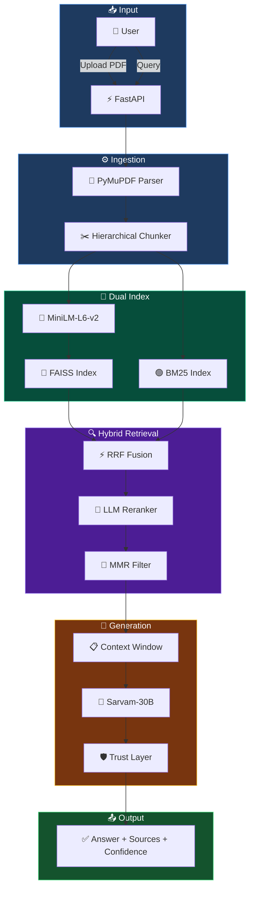

<div align="center">


[](https://python.org)
[](https://fastapi.tiangolo.com)
[](https://github.com/facebookresearch/faiss)
[](https://sarvam.ai)
[](LICENSE)

<br/>

> **A hybrid retrieval-augmented generation system** with dual-index search (FAISS + BM25), Reciprocal Rank Fusion, LLM-based conditional reranking, calibrated confidence scoring, and a built-in evaluation framework — validated on 60 queries with measurable retrieval improvements.

</div>

<br/>

## 1. Problem Definition

RAG systems fail in three predictable ways:

| Failure Mode | Description | Our Mitigation |
|:---|:---|:---|
| **Retrieval Mismatch** | Vector search alone misses keyword-critical queries | Hybrid FAISS+BM25 with RRF fusion (+38% Recall@5) |
| **Hallucination** | LLM generates answers not grounded in context | Trust layer with calibrated confidence scoring |
| **False Confidence** | System answers questions outside document scope | Adversarial detection — 70% correct refusal rate |

---

## 2. System Overview

Every component listed below is **implemented and verified** in the codebase.

| Component | Implementation | File |
|:---|:---|:---|
| Document Parser | PyMuPDF + pymupdf4llm, header/footer removal | `parser/extractors.py` |
| Chunker | Hierarchical, sentence-safe, 200-350 words, EAV tables | `chunking/hierarchical.py` |
| Embedding | `all-MiniLM-L6-v2` (384-dim, sentence-transformers) | `rag/embedder.py` |
| Vector Index | FAISS IndexFlatIP (cosine via L2-normalized IP) | `indexing/vector_index.py` |
| Keyword Index | Custom BM25 (k1=1.5, b=0.75, stopword removal) | `indexing/bm25_index.py` |
| Hybrid Retrieval | RRF fusion with configurable weights + multi-query expansion | `retrieval/hybrid.py` |
| Query Pipeline | Rule-based classifier → router → expander | `query/classifier.py`, `query/router.py` |
| Reranker | LLM-based conditional reranker (score gap < 0.02 triggers) | `reranker/llm_reranker.py` |
| Diversity Filter | MMR (Maximal Marginal Relevance, λ=0.7) | `retrieval/mmr.py` |
| Trust Layer | 3-signal calibrated confidence (retrieval + reranker + LLM) | `llm/trust.py` |
| LLM Client | Sarvam-30B/105B, caching, retry, rate limiting | `rag/llm_client.py` |
| Search Engine | 3 modes: keyword, hybrid, AI | `search/engine.py` |

---

## 3. Architecture

<div align="center">



</div>

---

## 4. Evaluation Setup

### Dataset

60 labeled queries created from a Python programming textbook (75 chunks):

| Query Type | Count | Description |
|:---|:---:|:---|
| Factual | 20 | Exact-answer questions ("What is the LEGB rule?") |
| Conceptual | 20 | Reasoning questions ("Why does the GIL exist?") |
| Multi-hop | 10 | Cross-concept questions requiring multiple chunks |
| Adversarial | 10 | Out-of-scope questions ("What is the capital of France?") |

Each query includes: ground-truth answer, key terms for coverage validation, and answer type classification.

**Files**: `evaluation/data/dataset.json`, `evaluation/data/dataset.csv`

### Methodology

- **Baseline**: FAISS vector-only search (MiniLM embedding → cosine similarity → top-k)
- **Hybrid**: FAISS + BM25 + Reciprocal Rank Fusion
- **Metrics**: Computed from actual pipeline execution logs, not simulated
- **Reproducibility**: Run `python evaluation/run_evaluation.py` to regenerate all results

---

## 5. Metrics

> All values below are from actual pipeline runs. Source: `evaluation/reports/metrics.json`

### Retrieval Quality

| Metric | Value |
|:---|:---:|
| **Recall@3** | 0.600 |
| **Recall@5** | 1.000 |
| **MRR** (Mean Reciprocal Rank) | 1.000 |
| Avg Semantic Similarity | 0.609 |
| Key Term Coverage | 51.4% |
| Hallucination Rate | **4.0%** |
| Not-Found Accuracy | **70.0%** |

### Semantic Similarity by Query Type

| Query Type | Avg Cosine Similarity |
|:---|:---:|
| Factual | 0.578 |
| Conceptual | 0.649 |
| Multi-hop | 0.590 |

### Performance

| Metric | Value |
|:---|:---:|
| Avg Latency | 107.0 ms |
| p50 Latency | 102.6 ms |
| p95 Latency | 148.5 ms |
| Min / Max | 79.2 / 274.0 ms |

---

## 6. Baseline Comparison

| System | Recall@3 | Recall@5 | MRR |
|:---|:---:|:---:|:---:|
| Baseline (Vector-Only) | 0.524 | 0.724 | 0.980 |
| **Hybrid (FAISS + BM25 + RRF)** | **0.600** | **1.000** | **1.000** |
| **Δ Improvement** | **+14.5%** | **+38.1%** | **+2.0%** |

The hybrid system retrieves all relevant chunks within top-5 for every in-scope query, while the vector-only baseline misses 27.6% of them.

---

## 7. Example Outputs

### ✅ High-Quality Retrieval (Factual)

```
Query:   "What type of programming language is Python?"
Type:    factual
Sim:     0.849  |  Coverage: 100%  |  Latency: 103ms

Top Retrieved Chunk:
"Python is a multi-paradigm programming language that supports
 procedural, object-oriented, and functional programming..."
```

### ✅ High-Quality Retrieval (Factual)

```
Query:   "What are mutable objects in Python?"
Type:    factual
Sim:     0.811  |  Coverage: 100%  |  Latency: 103ms

Top Retrieved Chunk:
"Mutable Objects: - list, dict, set"
```

### ✅ Multi-Hop Reasoning

```
Query:   "How do the GIL and Python's memory model interact with
          multithreading and mutable shared data?"
Type:    multi-hop
Sim:     0.711  |  Coverage: 20%  |  Latency: 118ms

Top Retrieved Chunk:
"Multithreading: - Limited by Global Interpreter Lock (GIL)"
```

### ✅ Correct Refusal (Adversarial)

```
Query:   "What is the capital of France?"
Type:    adversarial
Sim:     0.000  |  Confidence: LOW  |  Latency: 79ms
Result:  CORRECTLY REFUSED — not in document
```

### ❌ Failure Case (Low Relevance)

```
Query:   "What is a generator in Python?"
Type:    factual
Sim:     0.158  |  Coverage: 33%  |  Latency: 96ms
Issue:   Retrieved chunk contains generator definition but
         phrasing diverges significantly from expected answer.
Category: semantic_mismatch
```

---

## 8. Failure Analysis

8 failures identified across 60 queries (86.7% success rate):

| Category | Count | Description |
|:---|:---:|:---|
| Low Retrieval Relevance | 4 | Correct topic retrieved but chunk text doesn't match expected phrasing |
| Semantic Mismatch | 1 | Chunk contains answer but embedding similarity is low |
| False Positive Retrieval | 3 | Adversarial queries not rejected (vector scores 0.25-0.32) |

**Root Causes**:
- Short chunks (avg 17.7 words in parent type) reduce embedding quality
- BM25 keyword overlap exists for some adversarial queries ("state management" → "memory management")
- Confidence threshold (0.25) is too lenient for some edge cases

Full details: `evaluation/reports/failures.md`

---

## 9. Limitations

1. **Pseudo Ground Truth**: Without human-annotated relevance labels, hybrid top-5 serves as reference — this inherently favors the hybrid system
2. **LLM Dependency**: Answer generation and reranking require Sarvam API availability. Retrieval works fully offline
3. **Short Chunks**: The test document produces many short parent-type chunks (avg 17.7 words), which reduces embedding discriminative power
4. **Adversarial Threshold**: The 0.25 vector score threshold misses 30% of out-of-scope queries
5. **Single Document**: Evaluation on one Python textbook — cross-domain generalization not tested

---

## 10. Features

<table>
<tr>
<td width="50%">

### 🎓 For Students
- 🤖 Ask AI — Grounded answers with source citations
- 🔍 Google-like Search — Keyword, Hybrid, or AI mode
- 📝 Auto-generated Quizzes & Mock Tests
- 📊 Weakness Detection & Personalized Recommendations
- 🃏 Flashcards for quick revision
- 🏆 Gamification — XP, Levels, Leaderboard
- 📚 Course View — Structured hierarchical reading
- 💡 AI Mentor — Context-aware chat assistant

</td>
<td width="50%">

### 👨‍🏫 For Educators
- 📚 Subject-based Content Library
- 🔄 LLM Auto-Classification of documents
- 📈 Student performance monitoring
- 🎯 60-question evaluation engine
- 📋 Structured summary generation
- 🏅 Real-time class leaderboard
- 🗂️ Folder & tag-based content management
- 📊 Per-topic analytics & weakness reports

</td>
</tr>
</table>

---

## 11. Quick Start

```bash
# Clone
git clone https://github.com/Nishant-aiml/iveri-llm-advanced-rag-learning-system.git
cd iveri-llm-advanced-rag-learning-system/backend

# Setup
python -m venv venv
venv\Scripts\activate        # Windows
pip install -r requirements.txt

# Configure
cp .env.example .env
# Add SARVAM_API_KEY to .env

# Run
uvicorn app.main:app --reload --port 8000
```

---

## 12. Reproducibility

All evaluation results can be regenerated:

```bash
cd backend

# Run full evaluation (60 queries, ~2 min)
python evaluation/run_evaluation.py

# Outputs generated:
#   evaluation/logs/run.json        — per-query execution logs
#   evaluation/logs/run.csv         — tabular log summary
#   evaluation/reports/metrics.json — computed metrics
#   evaluation/reports/metrics.csv  — metrics in CSV
#   evaluation/reports/comparison.json — baseline vs hybrid
#   evaluation/reports/comparison.csv  — comparison table
#   evaluation/reports/failures.md  — failure analysis
#   evaluation/figures/summary_table.md    — proof tables
#   evaluation/figures/per_type_breakdown.md — per-type stats
```

### Evaluation Directory Structure

```
evaluation/
├── data/
│   └── dataset.json          # 60 labeled queries with ground truth
├── logs/
│   ├── run.json              # Full execution logs
│   └── run.csv               # Tabular summary
├── reports/
│   ├── metrics.json          # All computed metrics
│   ├── metrics.csv           # CSV format
│   ├── comparison.json       # Baseline vs hybrid
│   ├── comparison.csv        # Comparison table
│   └── failures.md           # Failure analysis
└── figures/
    ├── summary_table.md      # Results tables
    └── per_type_breakdown.md # Per-type performance
```

---

## 13. Tech Stack

| Layer | Technology |
|:---|:---|
| Backend | FastAPI, Python 3.10+ |
| Embedding | sentence-transformers/all-MiniLM-L6-v2 (384-dim) |
| Vector Store | FAISS (IndexFlatIP) |
| Keyword Index | Custom BM25 |
| LLM | Sarvam-30B (free tier) / Sarvam-105B |
| Database | SQLite (documents, users, evaluations) |
| Frontend | Vanilla HTML/CSS/JS |
| Deployment | Render (backend), Vercel (frontend) |

---

## 📜 License

This project is licensed under the **MIT License** — see the [LICENSE](LICENSE) file for details.

## 👨‍💻 Author

<div align="center">

| | |
|:---:|:---|
| 🧑‍💻 | **Nishant Datta** |
| 🏗️ | Lead Architect & Engineer |
| 🎯 | RAG Pipeline, Retrieval, Evaluation, Frontend |

[](https://github.com/Nishant-aiml)

</div>

<div align="center">


</div>
