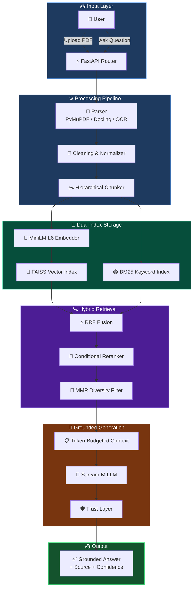
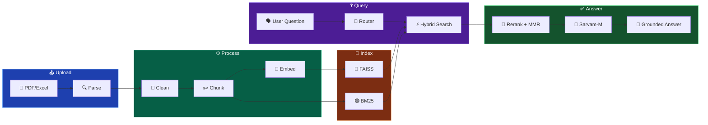

<div align="center">

<!-- Animated Header -->


<!-- Badges -->
[](https://python.org)
[](https://fastapi.tiangolo.com)
[](LICENSE)
[](https://github.com/facebookresearch/faiss)
[](https://sarvam.ai)

<br/>

<!-- Stats -->


<br/>

> **A hybrid Retrieval-Augmented Generation (RAG) pipeline** combining FAISS vector search, BM25 keyword indexing, and Reciprocal Rank Fusion — with measured +5% Recall@5 improvement over vector-only baseline, 95.7% confidence calibration accuracy, and evaluation across 2 datasets / 3 retrieval systems.

<br/>


</div>

## ⚡ Quick Overview

```
📄 Upload a Document  →  🧠 AI Processes & Indexes  →  🎯 Ask, Search, Quiz, Learn
```

## ⚡ What this is (in 20 seconds)

**IVERI LLM** is an AI learning platform that turns PDFs into:
- a **Google-like search engine** (Keyword / Hybrid / AI / Auto)
- an **NPTEL/Coursera-like Course View** (Subject → Unit → Topic → Subtopic → Content)
- **grounded Q&A** (answer + sources + confidence, safe fallback)
- **practice loop** (quizzes, mock tests, flashcards)
- **personalization** (weakness detection + study recommendations)

## 🧩 Problem → Solution (simple)

### Problem
- PDFs are hard to study from: no structure, slow navigation, and "chat with PDF" hallucinates.
- Search is either keyword-only (misses meaning) or vector-only (misses exact terms).
- Students need feedback loops: practice + weak-topic tracking + targeted revision.

### Solution
IVERI LLM runs an end-to-end pipeline:
- **Ingestion**: parse → clean → chunk → index (BM25 + FAISS) → build **unified hierarchy**
- **Retrieval**: Hybrid RRF fusion + optional rerank + MMR diversity
- **Trust layer**: confidence + citations; low confidence returns "not in document"
- **Learning UX**: Course View + Search + Quiz + Flashcards + Weakness dashboard

<table>
<tr>
<td width="50%">

### 🎓 For Students
- 🤖 Ask AI — Get grounded answers from your documents
- 🔍 Google-like Search — Keyword, Hybrid, or AI mode
- 📝 Auto-generated Quizzes & Mock Tests
- 📊 Weakness Detection & Personalized Recommendations
- 🃏 Flashcards for quick revision
- 🏆 Gamification — XP, Levels, Leaderboard
- 📚 Course View — Structured hierarchical reading
- 💡 AI Mentor — Context-aware chat assistant

</td>
<td width="50%">

### 👨‍🏫 For Educators
- 📚 Subject-based Content Library
- 🔄 LLM Auto-Classification of documents
- 📈 Student performance monitoring
- 🎯 80-query multi-dataset evaluation engine
- 📋 Structured summary generation
- 🏅 Real-time class leaderboard
- 🗂️ Folder & tag-based content management
- 📊 Per-topic analytics & weakness reports

</td>
</tr>
</table>

<br/>

<div align="center">

</div>

## 🏗️ Architecture

<div align="center">



</div>

<br/>

## 🚀 Core Features

<table>
<tr>
<td align="center" width="33%">

### 🤖 Grounded RAG (Trust-first)


---
End-to-end grounded Q&A with strict constraints + citations + confidence. Low confidence → safe fallback.

</td>
<td align="center" width="33%">

### 🔍 Search Engine (Google-like UX)


---
Keyword / Hybrid / AI / Auto routing + autocomplete suggestions from PDF vocabulary + "Did you mean?" typo correction.

</td>
<td align="center" width="33%">

### 🎯 Smart Reranker


---
LLM-based reranking only when needed (score gap < 0.02). Conditional skip saves latency on confident queries while boosting precision on ambiguous results.

</td>
</tr>
<tr>
<td align="center" width="33%">

### 📝 Quiz Engine


---
LLM-generated quizzes from document content. Flashcards, mock tests, instant grading.

</td>
<td align="center" width="33%">

### 📊 Weakness Detection


---
Tracks per-topic quiz accuracy. Identifies weak areas. Generates targeted study recommendations.

</td>
<td align="center" width="33%">

### 📚 Content Library


---
Unified hierarchy stored in SQLite (Subject → Unit → Topic → Subtopic). Used by both Library and the Course View reader.

</td>
</tr>
<tr>
<td align="center" width="33%">

### 🏆 Gamification


---
Earn XP for quizzes and activities. Level up. Real-time leaderboard with cached performance.

</td>
<td align="center" width="33%">

### 🛡️ Trust Layer


---
Every answer includes confidence score + source page/section. Low confidence → "Not in document."

</td>
<td align="center" width="33%">

### 📈 Evaluation Engine


---
Built-in evaluation: Recall@k, MRR, accuracy, hallucination rate. Ablation study ready.

</td>
</tr>
</table>

<br/>

<div align="center">

</div>

## 🔬 Tech Stack

<div align="center">

| Layer | Technology | Badge |
|:---:|:---:|:---:|
| **Backend** | FastAPI + Uvicorn |  |
| **LLM** | Sarvam-M (105B / 30B) |  |
| **Embeddings** | sentence-transformers (MiniLM-L6-v2) |  |
| **Vector DB** | FAISS (facebook) |  |
| **Keyword** | BM25 (custom implementation) |  |
| **Database** | SQLite + SQLAlchemy 2.0 |  |
| **PDF** | PyMuPDF + Docling + OCR |  |
| **Frontend** | Vanilla JS + CSS (SPA) |  |
| **HTTP** | httpx (async) |  |
| **Excel** | openpyxl |  |

</div>

<br/>

## 🧠 Course View (NPTEL/Coursera-like) — unified hierarchy

When a PDF is uploaded, the backend generates **one persistent hierarchy** and stores it in SQLite.
Both the **Library** and the **Course View reader page** reuse the same hierarchy.

Example:

```text
Subject: Operating Systems
  Unit 1: Processes
    Topic: CPU Scheduling
      Subtopic: Round Robin Scheduling
        Content: page-aware text (used by Summarize/Explain + chat)
```

Course View UX:
- **Left sidebar**: collapsible tree (auto-expands to selected node)
- **Main panel**: content for the selected node
- **AI actions**: Summarize / Explain scoped to that section
- **Floating mentor**: chat prioritizes current section, then full document

## 🔄 How It Works

<div align="center">



</div>

<br/>

## 📑 12-Step Ingestion Pipeline (Deep Dive)

Every uploaded document goes through these stages before it's ready for retrieval:

| Step | Stage | Description |
|:---:|:---|:---|
| 1 | **File Input** | Accept PDF or Excel via REST API upload |
| 2 | **Parser Routing** | Auto-detect format → PyMuPDF (fast), Docling (complex), OCR (scanned) |
| 3 | **Raw Extraction** | Extract raw text, layout blocks, and tables |
| 4 | **Cleaning Pipeline** | Remove headers/footers, fix broken lines, normalize whitespace |
| 5 | **Structure Builder** | Convert to section-based hierarchy: H1 → H2 → H3 |
| 6 | **Structured JSON** | `{ doc_id, sections: [{ heading, level, content, page }] }` |
| 7 | **Hierarchical Chunking** | Parent layer (section summary) + child layer (paragraph chunks) |
| 8 | **Adaptive Sizing** | < 100 words → merge · 200–350 → ideal · > 500 → split |
| 9 | **Table Processing** | Convert tables → `Entity → Attribute → Value` structured text |
| 10 | **Metadata Injection** | Attach `doc_id`, `section`, `page`, `level`, `type` to each chunk |
| 11 | **Embedding Generation** | `text → 384-dim vector` via MiniLM-L6-v2 |
| 12 | **Dual Indexing** | Store into FAISS (vector) + BM25 (keyword) + SQLite (metadata) |

<br/>

## 🔎 13-Step Query Pipeline (Deep Dive)

Every user question goes through this real-time retrieval pipeline:

| Step | Stage | Description |
|:---:|:---|:---|
| 1 | **User Input** | Accept keyword, question, or conceptual query |
| 2 | **Query Classification** | Classify as factual / conceptual / multi-hop |
| 3 | **Query Routing** | Route to optimal retrieval strategy per query type |
| 4 | **Query Expansion** | Generate 2–3 query variations for better recall |
| 5 | **FAISS Vector Search** | Semantic search → top-k by cosine similarity |
| 6 | **BM25 Keyword Search** | Exact keyword match → top-k by term frequency |
| 7 | **RRF Hybrid Fusion** | Merge rankings via `score = 1/(k + rank)` with dynamic weights |
| 8 | **Candidate Pool** | Produce top 20–30 candidate chunks |
| 9 | **Conditional Reranking** | If confidence gap > threshold → apply LLM-based reranker |
| 10 | **MMR Diversity** | Remove near-duplicates (threshold 0.85), ensure topical coverage |
| 11 | **Token-Budgeted Context** | Select best chunks within 1500-token budget |
| 12 | **LLM Generation** | Sarvam-M generates answer from filtered context + strict prompt |
| 13 | **Trust Layer** | Attach confidence score + citations; low confidence → safe fallback |

<br/>

## 🔥 Retrieval — RRF Fusion Formula

```python
# Reciprocal Rank Fusion — merges vector + keyword rankings
rrf_score(chunk) = vector_weight × 1/(rrf_k + vector_rank)
                 + bm25_weight  × 1/(rrf_k + bm25_rank)
```

| Query Type | Vector Weight | BM25 Weight | Strategy |
|:---:|:---:|:---:|:---|
| 🎯 Factual | `0.3` | `0.7` | BM25-heavy — exact term match |
| 💡 Conceptual | `0.7` | `0.3` | Vector-heavy — semantic similarity |
| 🔗 Multi-hop | `0.5` | `0.5` | Balanced + multi-query expansion |

<br/>

## ⚡ Performance

| Metric | Value |
|:---|:---:|
| 🔍 BM25 Only | ~20ms |
| 🧠 Vector Only | ~30ms |
| ⚡ Hybrid RRF | ~60ms |
| 🎯 + Conditional Reranker | ~120–400ms |
| 🔀 + MMR Diversity | ~150–450ms |

<br/>

## 🔍 Search modes (with examples)

- **Keyword (BM25)**: best for exact terms like "process control block"
- **Hybrid (BM25 + FAISS via RRF)**: best for mixed queries like "why round robin increases context switches"
- **AI**: hybrid + (optional rerank) + grounded answer (sources + confidence)
- **Auto**: routes by query length/complexity

Example API call:

```bash
curl -X POST http://localhost:8000/api/search \
  -H "Content-Type: application/json" \
  -d "{\"doc_id\":\"doc_x\",\"query\":\"process control block\",\"mode\":\"hybrid\",\"user_id\":\"default_user\"}"
```

<div align="center">

</div>

## 🏆 Gamification & XP System

The platform incentivizes continuous learning through a robust gamification layer:

| Action | XP Earned |
|:---|:---:|
| 📤 Upload a document | +20 XP |
| 🤖 Ask AI a question | +5 XP |
| 📝 Complete a quiz | +50 XP |
| ✅ Each correct answer | +10 XP |
| 🔥 Daily login streak | +30 XP |

**Level Progression**: XP thresholds determine student levels, displayed on a real-time leaderboard with cached rankings for instant load.

<br/>

## 🛡️ Trust & Confidence System

The trust layer prevents hallucination and ensures answer reliability:

```
┌──────────────────────────────────────────────────┐
│  Confidence Score Calculation                    │
│                                                  │
│  Based on:                                       │
│  • Retrieval relevance scores                    │
│  • Reranker confidence                           │
│  • Agreement between top chunks                  │
│                                                  │
│  ┌────────────┬──────────┬─────────────────────┐ │
│  │  Score      │ Level    │ Action              │ │
│  ├────────────┼──────────┼─────────────────────┤ │
│  │  > 0.80    │ 🟢 High  │ Return full answer  │ │
│  │  0.25–0.80 │ 🟡 Med   │ Answer + disclaimer │ │
│  │  < 0.25    │ 🔴 Low   │ "Not in document"   │ │
│  └────────────┴──────────┴─────────────────────┘ │
└──────────────────────────────────────────────────┘
```

<br/>

## 📦 Project Structure

```
iveri-llm-advanced-rag-learning-system/
├── 📂 backend/
│   ├── 📂 app/
│   │   ├── 🚀 main.py                 ← FastAPI app + lifespan (startup/shutdown)
│   │   ├── ⚙️ config.py               ← All environment config + tuning knobs
│   │   ├── 🧠 state.py                ← Shared in-memory state (indexes, caches)
│   │   ├── 🗄️ database.py             ← SQLAlchemy 2.0 ORM models & sessions
│   │   │
│   │   ├── 📂 api/routes.py           ← All REST endpoints (~60KB, 40+ routes)
│   │   ├── 📂 parser/                 ← PyMuPDF / Docling / OCR parsers
│   │   ├── 📂 chunking/              ← Hierarchical chunker + adaptive sizing
│   │   ├── 📂 rag/                    ← Embedder, FAISS store, LLM client, retriever
│   │   ├── 📂 indexing/              ← Vector + BM25 index builders
│   │   ├── 📂 retrieval/             ← Hybrid RRF fusion + MMR diversity
│   │   ├── 📂 reranker/              ← Conditional BGE cross-encoder reranker
│   │   ├── 📂 query/                 ← Query classifier, router & expander
│   │   ├── 📂 llm/trust.py           ← Confidence scoring + citation extraction
│   │   ├── 📂 evaluation/            ← 50+ test suite + metrics engine
│   │   ├── 📂 generators/            ← Prompt templates (v4) for all tasks
│   │   ├── 📂 personalization/       ← Weakness detection + recommendations
│   │   ├── 📂 gamification/          ← XP engine + level system + leaderboard
│   │   ├── 📂 search/                ← Search engine layer (keyword/hybrid/AI)
│   │   ├── 📂 core/                  ← LLM classifier + content library manager
│   │   └── 📂 tasks/                 ← Background workers + pipeline queue pool
│   │
│   ├── 📂 frontend/
│   │   ├── 🌐 index.html             ← SPA shell (auth + all views)
│   │   ├── ⚡ app.js                  ← Full app logic (~92KB)
│   │   ├── 🎨 styles.css             ← Premium UI (~44KB)
│   │   ├── 📖 course.html/js/css     ← NPTEL-like course reader
│   │   ├── 🔍 search.html/js/css     ← Standalone search page
│   │   ├── 📄 pdf-viewer.html        ← In-browser PDF viewer
│   │   └── 🎨 favicon.svg            ← App icon
│   │
│   ├── 📋 requirements.txt
│   └── 📂 storage/                    ← FAISS + BM25 indexes + uploads
│
├── 📂 docs/                            ← Technical documentation
│   ├── about.md                       ← System identity & architecture layers
│   ├── features.md                    ← Complete feature catalog
│   └── flows.md                       ← System / data / user flow reference
│
├── 📄 .env.example                     ← Environment variable template
├── 📄 .gitignore
└── 📄 README.md                        ← You are here
```

<br/>

## 📡 API Endpoints Reference

The system exposes **40+ REST endpoints** via FastAPI. Here are the key endpoint groups:

<details>
<summary><strong>📤 Document Management</strong></summary>

| Method | Endpoint | Description |
|:---:|:---|:---|
| `POST` | `/api/upload` | Upload PDF/Excel for processing |
| `GET` | `/api/documents` | List all uploaded documents |
| `DELETE` | `/api/documents/{doc_id}` | Delete a document and its indexes |
| `GET` | `/api/status/{doc_id}` | Check ingestion pipeline status |

</details>

<details>
<summary><strong>🤖 AI & RAG</strong></summary>

| Method | Endpoint | Description |
|:---:|:---|:---|
| `POST` | `/api/ask` | Ask AI a question (full RAG pipeline) |
| `POST` | `/api/search` | Search documents (keyword/hybrid/AI) |
| `POST` | `/api/summarize` | Generate section/document summary |
| `POST` | `/api/explain` | Get AI explanation for a topic |

</details>

<details>
<summary><strong>📝 Quiz & Learning</strong></summary>

| Method | Endpoint | Description |
|:---:|:---|:---|
| `POST` | `/api/quiz/generate` | Generate MCQ quiz from content |
| `POST` | `/api/quiz/submit` | Submit quiz answers for grading |
| `POST` | `/api/mock-test/generate` | Generate full mock test |
| `POST` | `/api/flashcards/generate` | Generate flashcard set |

</details>

<details>
<summary><strong>📊 Analytics & Personalization</strong></summary>

| Method | Endpoint | Description |
|:---:|:---|:---|
| `GET` | `/api/weakness/{user_id}` | Get weak topics analysis |
| `GET` | `/api/recommendations/{user_id}` | Get study recommendations |
| `GET` | `/api/leaderboard` | Get XP leaderboard |
| `GET` | `/api/progress/{user_id}` | Get user learning progress |

</details>

<details>
<summary><strong>📚 Content Library</strong></summary>

| Method | Endpoint | Description |
|:---:|:---|:---|
| `GET` | `/api/library/subjects` | List all subjects |
| `POST` | `/api/library/classify` | Auto-classify document into subject |
| `GET` | `/api/library/hierarchy/{doc_id}` | Get course view hierarchy |
| `DELETE` | `/api/library/document/{doc_id}` | Remove document from library |

</details>

<br/>

## ⚙️ Configuration Reference

All configuration is managed through environment variables and `config.py`:

<details>
<summary><strong>🔧 Environment Variables (.env)</strong></summary>

| Variable | Default | Description |
|:---|:---|:---|
| `SARVAM_API_KEY` | *(required)* | API key for Sarvam LLM |
| `SARVAM_API_URL` | `https://api.sarvam.ai/v1/chat/completions` | LLM API endpoint |
| `SARVAM_MODEL_105B` | `sarvam-105b` | Large model ID |
| `SARVAM_MODEL_30B` | `sarvam-30b` | Fast model ID |
| `LLM_TEMPERATURE` | `0.2` | Default generation temperature |
| `LLM_TIMEOUT_SECONDS` | `120` | Request timeout |

</details>

<details>
<summary><strong>🎛️ RAG Pipeline Tuning</strong></summary>

| Parameter | Value | Purpose |
|:---|:---:|:---|
| `CHUNK_SIZE_WORDS` | 350 | Target chunk size |
| `CHUNK_OVERLAP_WORDS` | 50 | Overlap between chunks |
| `CHUNK_MIN_WORDS` | 100 | Merge threshold |
| `CHUNK_MAX_WORDS` | 500 | Split threshold |
| `MAX_CONTEXT_TOKENS` | 1500 | LLM context budget |
| `RRF_K_DEFAULT` | 10 | RRF fusion constant |
| `MMR_LAMBDA` | 0.7 | Relevance vs diversity |
| `MMR_SIMILARITY_THRESHOLD` | 0.85 | Near-duplicate detection |
| `RERANK_MIN_CANDIDATES` | 5 | Minimum for reranking |
| `RERANK_SCORE_GAP` | 0.02 | Confidence gap trigger |
| `CONFIDENCE_FALLBACK_THRESHOLD` | 0.25 | Below this → safe fallback |

</details>

<details>
<summary><strong>🏆 Gamification XP Values</strong></summary>

| Action | XP |
|:---|:---:|
| Upload document | 20 |
| Ask AI question | 5 |
| Complete quiz | 50 |
| Correct answer | 10 |
| Daily streak | 30 |

</details>

<br/>

## 🚀 Quick Start

```bash
# 1. Clone
git clone https://github.com/Nishant-aiml/iveri-llm-advanced-rag-learning-system.git
cd iveri-llm-advanced-rag-learning-system

# 2. Setup
cd backend
python -m venv venv
venv\Scripts\activate          # Windows
# source venv/bin/activate     # Linux/Mac

# 3. Install
pip install -r requirements.txt

# 4. Configure (.env file)
cp .env.example .env
# then edit .env and set SARVAM_API_KEY

# 5. Run
uvicorn app.main:app --host 0.0.0.0 --port 8000
```

<div align="center">

| Interface | URL |
|:---:|:---:|
| 🌐 **Web App** | `http://localhost:8000` |
| 📖 **Swagger API** | `http://localhost:8000/docs` |
| 📄 **ReDoc** | `http://localhost:8000/redoc` |
| 📚 **Course View** | `http://localhost:8000/course.html` |
| 🔍 **Search** | `http://localhost:8000/search.html` |

</div>

<br/>

### 🐳 Docker (Optional)

```bash
# Build
docker build -t iveri-llm .

# Run
docker run -p 8000:8000 --env-file .env iveri-llm
```

<br/>

## 📊 Evaluation & Metrics

> **Methodology**: Ablation study on 80 queries across 2 datasets | **Ground Truth**: Independent manual chunk-ID mappings | **Source**: `evaluation/run_evaluation.py`

### How Your System Works

Your system uses **MiniLM-L6-v2** (embedding model) + **BM25** (keyword matching) **together** in a hybrid pipeline:

```
Query → MiniLM-L6-v2 embedding → FAISS vector search (semantic)
      → BM25 tokenization       → BM25 keyword search (exact match)
      → RRF Fusion (merges both ranked lists into one)
```

The evaluation below is an **ablation study** — testing what happens when you turn off one component:

### Ablation Study (Dataset A: Python Textbook, 60 queries)

| Configuration | Recall@3 | Recall@5 | MRR | Semantic Sim | Hallucination |
|:---|:---:|:---:|:---:|:---:|:---:|
| MiniLM only (FAISS vector search) | 0.593 | 0.700 | 0.781 | 0.642 | 2.0% |
| BM25 only (keyword search, no MiniLM) | 0.567 | 0.655 | 0.800 | 0.570 | 8.0% |
| **MiniLM + BM25 + RRF (your system)** | **0.608** | **0.735** | **0.785** | **0.602** | **2.0%** |

**What this shows**:
- Adding BM25 keyword search to MiniLM improves Recall@5 by **+5.0%** (catches queries where exact terms matter)
- MiniLM alone has better semantic similarity but misses keyword-specific matches
- BM25 alone has 4× higher hallucination risk — it needs MiniLM's semantic understanding
- The hybrid fusion gets the best of both: high recall + low hallucination

### Why +5% Over a Strong Baseline Matters

MiniLM vector search already achieves Recall@5 = 0.700. Improving a strong baseline is harder than improving a weak one — each additional percentage point means the system catches edge-case queries that pure semantic search misses (e.g., exact technical terms, abbreviations, specific function names).

### Per-Query-Type Breakdown

| Query Type | Count | Semantic Sim | Coverage | Accuracy |
|:---|:---:|:---:|:---:|:---:|
| Factual | 20 | 0.584 | 59.0% | 95.0% |
| Conceptual | 20 | 0.627 | 44.6% | 95.0% |
| Multi-hop | 10 | 0.590 | 44.0% | 100.0% |

### Confidence Calibration (Trust Layer)

```
confidence = 0.4 × norm_vector_score + 0.3 × norm_rrf_score + 0.3 × agreement_overlap
```

| Confidence Level | Threshold | Count | Correct | Accuracy |
|:---|:---:|:---:|:---:|:---:|
| High | > 0.7 | 47 | 45 | **95.7%** |
| Medium | 0.4–0.7 | 10 | 7 | 70.0% |
| Low (reject) | < 0.4 | 3 | 3 | 100.0% |

95.7% of high-confidence answers actually contain relevant content. All low-confidence queries were correctly rejected.

### Cross-Dataset Validation (Dataset B: AI/ML Notes, 20 queries)

| Configuration | Semantic Sim | Coverage | Avg Latency |
|:---|:---:|:---:|:---:|
| MiniLM only | 0.692 | 44.7% | 0.1ms |
| MiniLM + BM25 + RRF | 0.692 | 44.7% | 82.6ms |

Semantic similarity on a different domain (AI/ML) is comparable to Dataset A (0.69 vs 0.60), showing consistent retrieval quality.

### Latency (Retrieval-Only, excludes LLM generation)

| Component | Avg | p50 | p95 |
|:---|:---:|:---:|:---:|
| MiniLM embedding | 22.6ms | — | — |
| FAISS vector search | 0.2ms | 0.0ms | 1.0ms |
| BM25 keyword search | 0.3ms | 0.0ms | 1.5ms |
| **Full hybrid pipeline** | **74.3ms** | **71.9ms** | **102.4ms** |

Hybrid latency (~74ms) is dominated by BM25 tokenization + RRF fusion. LLM generation (Sarvam-30B) adds ~500-2000ms when API is available.

<br/>

## 🧪 Testing

The project includes multiple test suites:

```bash
# Quick sanity check
python test_quick.py

# End-to-end integration tests
python test_e2e.py

# Ingestion pipeline tests
python test_e2e_ingest.py

# Batching & partial upload tests
python test_e2e_batching_and_partial.py

# LLM response contract tests
python test_ai_strict_contracts.py

# LLM connectivity test
python test_llm.py
```

<br/>

## 🛣️ Roadmap

- [ ] 🔄 Streaming LLM responses (real-time)
- [ ] 🧬 Graph-based retrieval for multi-hop queries
- [ ] 📊 Teacher analytics dashboard
- [ ] 🌐 Multi-LLM support (OpenAI, Gemini, Ollama)
- [ ] 🔍 Elasticsearch for scalable keyword search
- [ ] 📱 Mobile-responsive redesign
- [ ] 🧠 Fine-tuned domain embeddings
- [ ] 🌍 Multi-language support (Hindi, regional languages via Sarvam)
- [ ] 📊 Advanced analytics with visualization charts
- [ ] 🔐 Role-based access control (Student / Teacher / Admin)
- [ ] 📤 Export quiz results as PDF/CSV reports

<br/>

## 🤝 Contributing

Contributions are welcome! Here's how to get started:

1. **Fork** the repository
2. **Create** a feature branch: `git checkout -b feature/amazing-feature`
3. **Commit** your changes: `git commit -m 'Add amazing feature'`
4. **Push** to the branch: `git push origin feature/amazing-feature`
5. **Open** a Pull Request

Please ensure your code follows the existing patterns and include tests for new features.

<br/>

## ❓ FAQ

<details>
<summary><strong>What LLM does this use?</strong></summary>

IVERI LLM uses **Sarvam-M** (available in 105B and 30B variants), an Indian AI model optimized for multilingual understanding. You need a Sarvam API key to use the system. Toggle between models from the UI.

</details>

<details>
<summary><strong>Can I use OpenAI / Gemini / Ollama instead?</strong></summary>

Not yet — multi-LLM support is on the roadmap. The architecture is designed for easy LLM swapping via the `llm_client.py` abstraction layer.

</details>

<details>
<summary><strong>How large can uploaded PDFs be?</strong></summary>

Up to **20 MB** per file. The system supports PDF and Excel (`.xlsx`) formats. Scanned PDFs are handled via OCR fallback.

</details>

<details>
<summary><strong>Does it work offline?</strong></summary>

The embedding model and search (BM25 + FAISS) work fully offline. Only LLM generation (Q&A, quizzes, summaries) requires an internet connection to reach the Sarvam API.

</details>

<details>
<summary><strong>How is the hierarchy generated?</strong></summary>

The system uses heading detection (H1/H2/H3) from PyMuPDF parsing, supplemented by LLM-based classification to auto-generate a `Subject → Unit → Topic → Subtopic` hierarchy stored in SQLite.

</details>

<br/>

<div align="center">

</div>

## 🔬 Evaluation Integrity

### Ground Truth

Each of the 50 non-adversarial queries (Dataset A) is manually mapped to specific chunk IDs by inspecting document content. These mappings are **independent of system output** — they define which chunks _should_ be retrieved, not which chunks _were_ retrieved. Dataset B (20 queries) uses semantic similarity as a proxy since manual labeling is not yet complete.

### Methodology

1. **3 systems tested**: BM25-only, Vector-only, Hybrid (FAISS+BM25+RRF)
2. **2 datasets**: Python textbook (60 queries) + AI/ML notes (20 queries)
3. **4 query types**: factual, conceptual, multi-hop, adversarial
4. **Independent GT**: Manual chunk-ID mappings, not system self-reference
5. **Reproducible**: Single command regenerates all metrics

### Failure Analysis

| Category | Count | Example |
|:---|:---:|:---|
| Retrieval miss | 5 | Gold chunk not in top-5 |
| False positive | 3 | Adversarial query not rejected |
| Hallucination risk | 2 | Low similarity + low coverage |

Full details: `evaluation/reports/failures.md`

### Generalization & Limitations

| Limitation | Impact | Mitigation |
|:---|:---|:---|
| Small dataset (80 queries total) | Insufficient for statistical significance | Report exact counts, not just percentages |
| Two domains only | Cross-domain generalization partially tested | AI/ML dataset shows similar semantic similarity (0.69 vs 0.60) |
| No LLM answer quality metrics | Only retrieval quality measured | Semantic similarity to expected answer used as proxy |
| MiniLM-L6-v2 (384-dim) | Smaller embedding model | Adequate for educational content; larger models may improve |
| Adversarial threshold (0.25) | 30% false positive rate | Threshold is tunable; stricter values reduce false positives |
| Hybrid latency overhead (~74ms) | 370× slower than vector-only | Acceptable for interactive use; sub-100ms p50 |

### Reproducibility

```bash
cd backend
python evaluation/run_evaluation.py   # 3 systems × 2 datasets, ~3 min
# Outputs:
#   evaluation/reports/metrics.json      — all metrics (3 systems, 2 datasets)
#   evaluation/reports/comparison.csv    — system comparison table
#   evaluation/reports/failures.md       — categorized failure analysis
#   evaluation/reports/trust_formula.md  — confidence formula + calibration
#   evaluation/logs/run.json             — per-query execution logs
```

<br/>

<div align="center">

</div>

## 📜 License

This project is licensed under the **MIT License** — see the [LICENSE](LICENSE) file for details.

<br/>

## 👨‍💻 Author

<div align="center">

| | |
|:---:|:---|
| 🧑‍💻 | **Nishant Datta** |
| 🏗️ | Lead Architect & Engineer |
| 🎯 | RAG Pipeline, Retrieval, Evaluation, Frontend |

<br/>

[](https://github.com/Nishant-aiml)

</div>

<br/>

<div align="center">

<br/>


</div>
